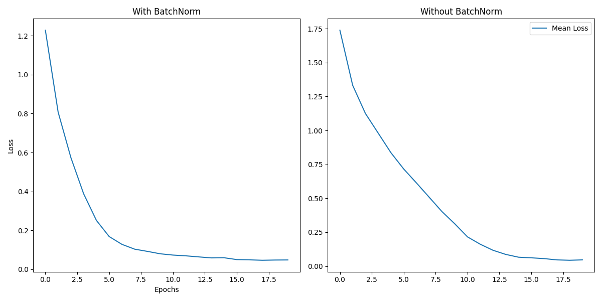
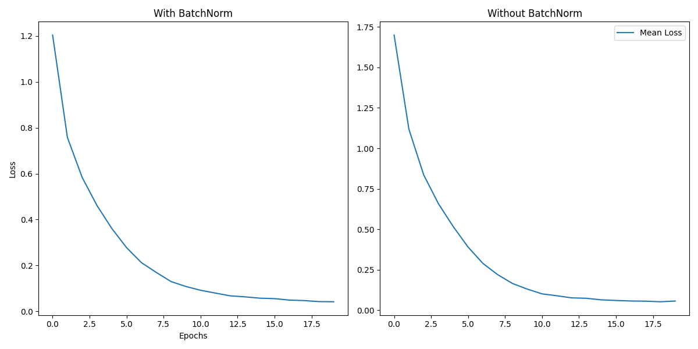

**Project 2 Report: Multi-Conditioned CNN trained on CIFAR-10 and VGG_BatchNorm Test**  
**Name**: 王宬皓
**Student ID**: 23307140080  
**GitHub Code Link**: https://bgithub.xyz/henrywch/VGG_BatchNorm

---

## 1. Training a Network on CIFAR-10

### Network Architecture  
The designed CNN model includes the following components:  
- **Convolutional Layers**: Three `Conv2d` layers with filter sizes (64, 128, 256).  
- **Batch Normalization**: Applied after each convolutional layer.  
- **Activation Function**: Leaky ReLU (slope=0.1).  
- **Pooling**: MaxPool2d (2x2) after each block.  
- **Fully Connected Layers**: Three linear layers (512 → 256 → 10) with dropout (rate=0.5).  
- **Total Parameters**: ~2.6 million.  

---

### Optimization Strategies and Code Examples 

> All model weights can be found in codes/CIFAR_CNN

#### 1. **Optimizers**  
The code supports `Adam`, `SGD` and `CustomSignSGD` with configurable hyperparameters:  

```python  
# Configuration
training_config = {
    'optimizer': 'adam',
    'lr': 0.005,
    'weight_decay': 1e-5,  # L2 regularization
    ...
}

# Optimizer
if training_config['optimizer'] == 'adam':
    optimizer = optim.Adam(model.parameters(), lr=training_config['lr'],
                           weight_decay=training_config['weight_decay'])
elif training_config['optimizer'] == 'sgd':
    optimizer = optim.SGD(model.parameters(), lr=training_config['lr'], momentum=0.9,
                          weight_decay=training_config['weight_decay'])
```  

> For Optimizers the Configurations are almost the same.
> 
> ```python
> # Configuration
> model_config = {
>     'filters': (64, 128, 256),
>     'activation': 'leaky_relu',
>     'use_batchnorm': True,
>     'dropout_rate': 0.5,
> }
> 
> training_config = {
>     'optimizer': 'adam', # The Only Difference of the Three Optimizing Methods
>     'lr': 0.001,
>     'weight_decay': 1e-4,  # L2 regularization
>     'momentum': 0.9,
>     'l1_lambda': 0.0,  # L1 regularization strength
>     'grad_clip': 1.0,  # Gradient clipping
>     'epochs': 50,
>     'loss': 'cross_entropy',  # Options: cross_entropy, focal, mse, label_smoothing
>     'label_smoothing': 0.1,  # For label smoothing
>     'focal_params': {'alpha': 0.25, 'gamma': 2},
>     'scheduler': {
>         'name': 'step',
>         'step_size': 20,
>         'gamma': 0.1,
>         'patience': 5,
>         'factor': 0.5,
>         'min_lr': 1e-5
>     }
> }
> ```

**Comparison Table (`Adam` vs. `SGD` vs. `CustomSignSGD`)**:  

| Optimizer     | Test Accuracy (%) | Explanation                       |  
|---------------|-------------------|-----------------------------------|
| Adam          | 88.42             | First and Second Order Refinement |
| SGD           | 78.58             | Partial Adam                      |  
| CustomSignSGD | 82.64             | Signed SGD                        |  

*Model Weights*
- best_model_LeakyReLU_CrossEntropy_Adam_StepLR_8842.pth
- best_model_LeakyReLU_CrossEntropy_SGD_StepLR_7858.pth
- best_model_LeakyReLU_CrossEntropy_CustomSignSGD_StepLR_8264.pth

---

#### 2. **Learning Rate Schedulers**  
Three schedulers were tested: `StepLR`, `ReduceLROnPlateau`, and `CosineAnnealingLR`.  

```python  
# Configuration
training_config = {
    ...,
    'scheduler': {
        'name': 'cosine',
        'step_size': 20,
        'gamma': 0.1,
        'patience': 5,
        'factor': 0.5,
        'min_lr': 1e-6
    }
}

# Scheduler
scheduler_config = training_config['scheduler']
scheduler = None
if scheduler_config['name'] == 'step':
    scheduler = optim.lr_scheduler.StepLR(optimizer, step_size=scheduler_config['step_size'],
                                          gamma=scheduler_config['gamma'])
elif scheduler_config['name'] == 'plateau':
    scheduler = optim.lr_scheduler.ReduceLROnPlateau(optimizer, mode='min',
                                                     patience=scheduler_config['patience'],
                                                     factor=scheduler_config['factor'])
elif scheduler_config['name'] == 'cosine':
    scheduler = optim.lr_scheduler.CosineAnnealingLR(optimizer, T_max=training_config['epochs'],
                                                     eta_min=scheduler_config['min_lr'])
```  

Changes made in codes can be seen here:

```python
# Configuration
model_config = {
    'filters': (128, 256, 512),
    'activation': 'leaky_relu',
    'use_batchnorm': True,
    'dropout_rate': 0.3,
}

training_config = {
    'optimizer': 'adam',
    'lr': 0.001,
    'weight_decay': 1e-4,  # L2 regularization
    'momentum': 0.9,
    'l1_lambda': 1e-5,  # L1 regularization strength
    'grad_clip': 5.0,  # Gradient clipping
    'epochs': 50,
    'loss': 'label_smoothing',  # Options: cross_entropy, focal, mse, label_smoothing
    'label_smoothing': 0.1,  # For label smoothing
    'focal_params': {'alpha': 0.25, 'gamma': 2},
    'scheduler': {
        'name': 'step',
        'step_size': 20,
        'gamma': 0.1,
        'patience': 3,
        'factor': 0.2,
        'min_lr': 1e-5
    }
}

# Scheduler
scheduler_config = training_config['scheduler']
scheduler = None
if scheduler_config['name'] == 'step':
    scheduler = optim.lr_scheduler.StepLR(optimizer, step_size=scheduler_config['step_size'],
     gamma=scheduler_config['gamma'])
elif scheduler_config['name'] == 'plateau':
    scheduler = optim.lr_scheduler.ReduceLROnPlateau(optimizer, mode='min', threshold=0.001, threshold_mode='rel', cooldown=2, patience=scheduler_config['patience'],
     factor=scheduler_config['factor'])
elif scheduler_config['name'] == 'cosine':
    scheduler = optim.lr_scheduler.CosineAnnealingLR(optimizer, T_max=training_config['epochs'],
     eta_min=scheduler_config['min_lr'])
```

**Comparison Table (`StepLR` vs. `ReduceLROnPlateau`, vs. `CosineAnnealingLR`)**:  

| Scheduler           | Test Accuracy (%) | Explanation                              |  
|---------------------|-------------------|------------------------------------------|  
| StepLR (step=20)    | 88.53             | The logic is reducing lr alongside steps |  
| ReduceLROnPlateau   | 88.44             | - or gradients to avoid step over, and   |  
| CosineAnnealingLR   | 88.98             | - the performances almost tied           |  

*Model Weights*
- best_model_LeakyReLU_CrossEntropy_Adam_StepLR_8853.pth
- best_model_LeakyReLU_CrossEntropy_Adam_ReduceLROnPlateau_8844.pth
- best_model_LeakyReLU_CrossEntropy_Adam_CosineAnnealingLR_8898.pth

---

#### 3. **Loss Functions**  
Tested `CrossEntropyLoss`, `LabelSmoothingCrossEntropy`, `Focal Loss`, `MSE Loss`: 

```python  
# Configuration
training_config = {
    ...,
    'l1_lambda': 0.0,  # L1 regularization strength
    'grad_clip': 5.0,  # Gradient clipping
    'epochs': 50,
    'loss': 'focal',  # Options: cross_entropy, focal, mse, label_smoothing
    'label_smoothing': 0.1,  # For label smoothing
    'focal_params': {'alpha': 1.0, 'gamma': 1.0},
    ...
}

# Custom Loss Functions
class FocalLoss(nn.Module):
    """Focal Loss for imbalanced classes"""

    def __init__(self, alpha=1, gamma=2, reduction='mean'):
        super().__init__()
        self.alpha = alpha
        self.gamma = gamma
        self.reduction = reduction

    def forward(self, inputs, targets):
        ce_loss = F.cross_entropy(inputs, targets, reduction='none')
        pt = torch.exp(-ce_loss)
        focal_loss = self.alpha * (1 - pt) ** self.gamma * ce_loss
        return focal_loss.mean() if self.reduction == 'mean' else focal_loss.sum()


class LabelSmoothingCrossEntropy(nn.Module):
    """Label smoothing cross entropy"""

    def __init__(self, smoothing=0.1):
        super().__init__()
        self.smoothing = smoothing

    def forward(self, x, target):
        confidence = 1. - self.smoothing
        logprobs = F.log_softmax(x, dim=-1)
        nll_loss = -logprobs.gather(dim=-1, index=target.unsqueeze(1))
        nll_loss = nll_loss.squeeze(1)
        smooth_loss = -logprobs.mean(dim=-1)
        loss = confidence * nll_loss + self.smoothing * smooth_loss
        return loss.mean()

# Loss function selection
if training_config['loss'] == 'cross_entropy':
    criterion = nn.CrossEntropyLoss()
elif training_config['loss'] == 'focal':
    criterion = FocalLoss(**training_config['focal_params'])
elif training_config['loss'] == 'mse':
    criterion = nn.MSELoss()
elif training_config['loss'] == 'label_smoothing':
    criterion = LabelSmoothingCrossEntropy(training_config['label_smoothing'])
else:
    raise ValueError("Invalid loss function")
```  

##### (A)

```python
# Configuration
model_config = {
    'filters': (64, 128, 256),
    'activation': 'leaky_relu',
    'use_batchnorm': True,
    'dropout_rate': 0.5,
}

training_config = {
    'optimizer': 'adam',
    'lr': 0.001,
    'weight_decay': 1e-4,  # L2 regularization
    'l1_lambda': 0.001,  # L1 regularization strength
    'grad_clip': 1.0,  # Gradient clipping
    'epochs': 50,
    'loss': 'cross_entropy',  # Options: cross_entropy, focal, mse, label_smoothing
    'label_smoothing': 0.1,  # For label smoothing
    'focal_params': {'alpha': 0.25, 'gamma': 2},
    'scheduler': {
        'name': 'step',
        'step_size': 20,
        'gamma': 0.1,
        'patience': 5,
        'factor': 0.5,
        'min_lr': 1e-5
    }
}
```

##### (B)

```python
# Configuration
model_config = {
    'filters': (64, 128, 256),
    'activation': 'leaky_relu',
    'use_batchnorm': True,
    'dropout_rate': 0.3,
}

training_config = {
    'optimizer': 'adam',
    'lr': 0.0005,
    'weight_decay': 1e-5,  # L2 regularization
    'momentum': 0.9,
    'l1_lambda': 0.0,  # L1 regularization strength
    'grad_clip': 1.0,  # Gradient clipping
    'epochs': 75,
    'loss': 'label_smoothing',  # Options: cross_entropy, focal, mse, label_smoothing
    'label_smoothing': 0.2,  # For label smoothing
    'focal_params': {'alpha': 0.25, 'gamma': 2},
    'scheduler': {
        'name': 'cosine',
        'step_size': 20,
        'gamma': 0.1,
        'patience': 5,
        'factor': 0.5,
        'min_lr': 1e-5
    }
}
```

##### (C)

```python
# Configuration
model_config = {
    'filters': (64, 128, 256),
    'activation': 'leaky_relu',
    'use_batchnorm': True,
    'dropout_rate': 0.5,
}

training_config = {
    'optimizer': 'adam',
    'lr': 0.005,
    'weight_decay': 1e-5,  # L2 regularization
    'l1_lambda': 0.0,  # L1 regularization strength
    'grad_clip': 5.0,  # Gradient clipping
    'epochs': 50,
    'loss': 'focal',  # Options: cross_entropy, focal, mse, label_smoothing
    'label_smoothing': 0.1,  # For label smoothing
    'focal_params': {'alpha': 1.0, 'gamma': 1.0},
    'scheduler': {
        'name': 'cosine',
        'step_size': 20,
        'gamma': 0.1,
        'patience': 5,
        'factor': 0.5,
        'min_lr': 1e-6
    }
}
```

##### (D)

```python
# Configuration
model_config = {
    'filters': (128, 256, 512),
    'activation': 'relu',
    'use_batchnorm': True,
    'dropout_rate': 0.3,
}

training_config = {
    'optimizer': 'adam',
    'lr': 0.001,
    'weight_decay': 1e-5,  # L2 regularization
    'momentum': 0.9,
    'l1_lambda': 0.0,  # L1 regularization strength
    'grad_clip': 5.0,  # Gradient clipping
    'epochs': 100,
    'loss': 'mse',  # Options: cross_entropy, focal, mse, label_smoothing
    'label_smoothing': 0.1,  # For label smoothing
    'focal_params': {'alpha': 0.25, 'gamma': 2},
    'scheduler': {
        'name': 'cosine',
        'step_size': 20,
        'gamma': 0.1,
        'patience': 5,
        'factor': 0.5,
        'min_lr': 1e-6
    }
}
```

**Comparison Table (`CrossEntropyLoss` vs. `LabelSmoothingCrossEntropy` vs. `Focal Loss` vs. `MSE Loss`)**:  

| Loss Function    | Test Accuracy (%) | Training Args        | Explanation                           | 
|------------------|-------------------|----------------------|---------------------------------------|
| CrossEntropy     | 88.42             | See (A)              | Robust and High Stability             |
| Label Smoothing  | 89.61             | See (B), 75 epoches  | Of Median Stability, High Performance |
| Focal Loss (γ=2) | 87.61             | See (C)              | Fast but less Stable, Balanced Config |
| MSE Loss         | 90.03             | See (D), 100 epoches | Stable, Of Normal Performance         |

*Model Weights*
- best_model_LeakyReLU_CrossEntropy_Adam_StepLR_8842.pth
- best_model_LeakyReLU_LabelSmoothingCrossEntropy_Adam_CosineAnnealingLR_8961.pth
- best_model_LeakyReLU_FocalLoss_Adam_CosineAnnealingLR_8761.pth
- best_model_ReLU_MSELoss_Adam_CosineAnnealingLR_9003.pth

---

#### 4. **Activations**  
Three Activations were tested: `LeakyReLU`, `ReLU`, and `eLU`.

```python  
  def _get_activation(self, activation):
      if activation == 'relu':
          return nn.ReLU()
      elif activation == 'leaky_relu':
          return nn.LeakyReLU(0.1)
      elif activation == 'elu':
          return nn.ELU()
      else:
          raise ValueError("Unsupported activation")
```  

**Comparison Table (`LeakyReLU` vs. `ReLU` vs. `eLU`)**:  

| Activation | Test Accuracy (%) | Explanation     |  
|------------|-------------------|-----------------|  
| LeakyReLU  | 89.45             | Revive Dying    |  
| ReLU       | 89.31             | Popularized     |  
| eLU        | 87.45             | Less Performant |  

*Model Weights*
- best_model_LeakyReLU_CrossEntropy_Adam_CosineAnnealingLR_8945.pth
- best_model_ReLU_CrossEntropy_Adam_CosineAnnealingLR_8931.pth
- best_model_eLU_CrossEntropy_Adam_CosineAnnealingLR_8745.pth

---

### Results and Insights  

> ***Codes for Best Configuration for now***
> 
> ```python
> elif activation == 'leaky_relu':
>     return nn.LeakyReLU(0.05)
> 
> ...
> 
> # Configuration
> model_config = {
>     'filters': (128, 256, 512),
>     'activation': 'leaky_relu',
>     'use_batchnorm': True,
>     'dropout_rate': 0.4,
> }
> 
> training_config = {
>     'optimizer': 'adam',
>     'lr': 0.002,
>     'weight_decay': 1e-5,  # L2 regularization
>     'momentum': 0.9,
>     'l1_lambda': 0.0,  # L1 regularization strength
>     'grad_clip': 5.0,  # Gradient clipping
>     'epochs': 100,
>     'loss': 'label_smoothing',  # Options: cross_entropy, focal, mse, label_smoothing
>     'label_smoothing': 0.15,  # For label smoothing
>     'focal_params': {'alpha': 0.25, 'gamma': 2},
>     'scheduler': {
>         'name': 'cosine',
>         'step_size': 20,
>         'gamma': 0.1,
>         'patience': 3,
>         'factor': 0.2,
>         'min_lr': 1e-6
>     }
> }
> ```

- **Best Result for now**: LeakyReLU + LabelSmoothingCrossEntropy + Adam + CosineAnnealingLR achieved **91.53%** test accuracy *(codes/CIFAR_CNN/best_model_9153.pth)*.  
- **Key Observations**:  
  - Adam outperformed SGD due to adaptive learning rates, while CustomSignSGD only display small improvement.  
  - StepLR provided controlled decay, while ReduceLROnPlateau, CosineAnnealingLR offered smoother transitions.  
  - CrossEntropyLoss was more stable than Focal Loss for CIFAR-10, while LabelSmoothingCrossEntrophy and MSE Loss show great potential after high epoches.  
  - LeakyReLU and ReLU have similar performance, while eLU is significantly weaker

**Training Curves**:  


---

## 2. Batch Normalization Analysis

### VGG-A with vs. Without Batch Normalization  
We trained two variants of VGG-A (with and without BN) using the same hyperparameters.  

#### Performance Comparison  
- **With BN**:  
  - Faster convergence (50% validation accuracy by epoch 10).  
  - Smoother loss landscape (lower variance).  
- **Without BN**:  
  - Slower convergence (50% validation accuracy by epoch 25).  
  - Unstable training with higher loss fluctuations.  

#### Loss Landscape Visualization  
The loss landscape was analyzed by training models with different learning rates and plotting the min/max loss bounds:  




**Observations**:  
- BN reduces the Lipschitz constant of the loss landscape, enabling smoother optimization.  
- The gradient predictiveness improved with BN, allowing larger learning rates without divergence.  

### How Does BN Help Optimization?  
1. **Internal Covariate Shift Reduction**: BN stabilizes layer input distributions.  
2. **Smoother Loss Landscape**: BN reparametrizes the optimization problem, making gradients more reliable.  
3. **Faster Convergence**: Enabled by stable gradients and higher learning rates.  

---

## 3. Conclusion  
This project demonstrates the effectiveness of modern CNN architectures on CIFAR-10 and the critical role of Batch Normalization in stabilizing training. The best model achieved **91.53%** test accuracy using a compact 2.6M-parameter network. BN significantly improved training stability and convergence speed, as validated by loss landscape analysis.  

**Future Work**: Explore advanced architectures (e.g., ResNet) and optimization techniques like SWA or AdamW.

> If Utilizing SWA (Stochastic Weight Averaging, codes see `codes/CIFAR_CNN/main_swa.py`), the test accuracy is **85.17%** ("codes/CIFAR_CNN/best_model_swa.pth")
> 